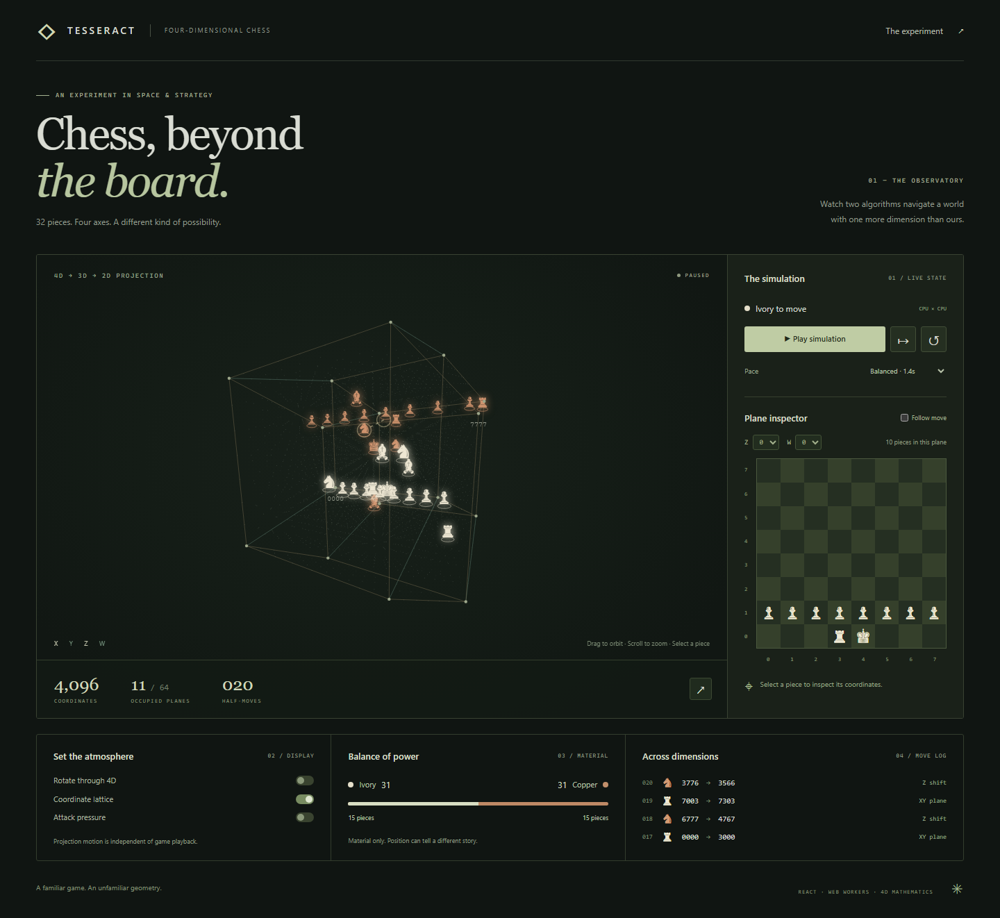

# Tesseract

**Chess, beyond the board.** An interactive, autonomous chess experiment on an
8 × 8 × 8 × 8 grid. Watch two CPUs explore four-dimensional space, then inspect
any of its 64 ordinary chessboard slices.



## Run it

Use Node.js 22.12+ (Node 24 recommended).

```sh
npm run setup
npm run dev
```

Open the local URL printed by Vite. There is no Python server, API key, account,
or environment configuration. Each tab owns an independent game. The game runs
locally after the page loads; refreshing starts a new game.

```sh
npm run build      # Static production files in frontend/dist
npm run preview    # Serve the production build locally
```

## Explore

- **Play / pause / step / reset:** watch CPU-vs-CPU play or examine one move at a time.
- **Orbit and zoom:** drag or scroll over the projection. With keyboard focus on
  the canvas, use arrow keys, `+` / `-`, and `Home` to reset the camera.
- **Plane inspector:** select Z and W to reveal an XY slice; enable Follow move
  to track the destination plane. Select a piece to read its four coordinates.
- **Display:** toggle 4D rotation, the coordinate lattice, or attack pressure.
- **Immersive view:** use the projection's expand button; exit with its button
  or `Escape`. Playback continues independently of projection rotation.
- **The experiment:** opens the in-app explanation of rules and mathematics.

The app starts paused. Reduced-motion preferences disable automatic rotation and
piece interpolation. Hiding the tab pauses playback. An already computing move
may finish when paused; reset invalidates pending responses.

## The variant

Coordinates are always **[x, y, z, w]**, each from 0 through 7. The plane inspector
shows X horizontally and Y vertically; Z and W select one of 64 planes.
Ivory starts on Z = W = 0 and Copper on Z = W = 7, with standard back ranks and
eight pawns per side. These are explicit project rules, not a claim of a single
standardized version of four-dimensional chess.

| Piece | Movement |
| --- | --- |
| Rook | Slides along exactly one axis. |
| Bishop | Slides equal distances along exactly two axes. |
| Queen | Slides equal distances along any nonempty combination of axes. |
| Knight | Jumps two cells along one axis and one along a different axis. |
| King | One cell along any nonempty combination of axes, without entering check. |
| Pawn | Advances along Y; captures one step along Y plus one step along X, Z, or W. A clear two-step advance is allowed from the starting Y rank. Promotes automatically to queen at the opposite Y edge. |

Sliders stop at the first occupied coordinate. Kings are never captured.
Checkmate and stalemate end the game, as do threefold repetition, 100 half-moves
without a pawn move or capture, and kings-only positions. A 500-half-move limit
also ends the simulation. Castling and en passant are not part of this variant.

The CPU uses a **one-ply heuristic**, rewarding captures, promotion, and movement
toward the center while penalizing attacked destinations and recent repeat moves.
Random jitter gives runs variety. It does not perform minimax or claim competitive
playing strength. Material scores exclude kings (P=1, N=3, B=3.5, R=5, Q=9).

Attack pressure counts geometric attacks, including defended friendly squares and
pinned pieces. Pawn pushes are excluded. It is not a count of legal moves or a
win-probability estimate.

## Architecture

```text
React controls ── messages ── Web Worker
      │                       ├─ sparse-board move engine
      │                       ├─ king-safety / end-state checks
      │                       └─ CPU scoring and attack map
      ├─ Canvas projection (requestAnimationFrame)
      └─ Accessible DOM plane inspector and telemetry
```

- `frontend/src/engine.js`: pure game functions; sparse occupancy maps avoid
  repeatedly scanning all 4,096 cells. King safety uses direct attack tests.
- `frontend/src/engine.worker.js`: owns game state away from the UI thread.
  Requests carry a generation number so stale results cannot undo a reset.
- `frontend/src/projection.js`: successive XW and ZW rotations, then perspective
  division by the fourth coordinate. This is not an isoclinic rotation: the
  rotation planes share W and run at different speeds.
- `frontend/src/Universe.jsx`: a 3D camera projects the result to Canvas 2D.
  Depth sorting, bounded device pixel ratio, move interpolation, picking, and
  pointer/keyboard controls require no WebGL or external fonts.
- `frontend/src/App.jsx`: playback scheduling, inspector, move history, and rules.
- `backend/`: preserved Python/FastAPI prototype, **not used or supported by the
  portfolio build**. `context.md` is the historical concept note.

The projection can visually overlap pieces that are distant in 4D. The inspector
is the precise view. Games are not saved across reloads; there is no human-play,
multiplayer, or deep-search mode.

## Validate

```sh
npm run lint
npm test
npm --prefix frontend run format:check
npm exec --prefix frontend -- playwright install chromium
npm run test:e2e
```

The Node tests cover movement vectors, blocking, pawn attacks, pinned pieces,
king safety, promotion, terminal states, input immutability, and finite projection
coordinates. A seeded simulation cross-checks the direct attack detector against
expanded attack maps. Playwright runs the production build in desktop and mobile
Chromium and exercises playback, inspection, reset races, display controls,
reduced motion, the explanation dialog, and responsive layout.

CI runs these checks on pushes and pull requests. Browser traces are retained on
failure, and screenshots are available in the `browser-results` artifact.

## Publish

The deployable artifact is **`frontend/dist/`**. Relative asset and worker URLs
support hosting at the domain root or in a project subdirectory. Serve it over
HTTP(S), not by opening `index.html` directly from the filesystem.

**GitHub Pages:** after pushing this repository, set Settings → Pages → Source
to GitHub Actions. Run **Publish portfolio demo** from the Actions tab. The
workflow builds and uploads the static site; its deployment output contains the
live URL. Publication is manual, not triggered by every commit.

**Netlify:** import the repository; the root `netlify.toml` sets the install/build
command and publish directory. Other static hosts can run
`npm ci --prefix frontend && npm run build` and publish `frontend/dist`.

See [the portfolio write-up](docs/PORTFOLIO.md) for project-card copy, technical
talking points, and a short demo walkthrough.
